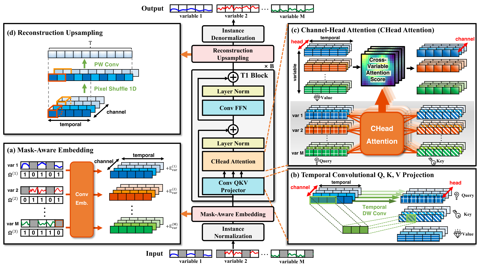

# T1: One-to-One Channel-Head Binding for Multivariate Time-Series Imputation

This is the official implementation of **T1**, accepted at **ICLR 2026**.

> Dongik Park, Hyunwoo Ryu, Suahn Bae, Keondo Park, and Hyung-Sin Kim
> Graduate School of Data Science, Seoul National University

T1 introduces **Channel-Head Binding** — a mechanism creating one-to-one correspondence between CNN channels and attention heads — enabling selective information transfer that adapts based on observable patterns, down-weighting corrupted channels while maintaining reliable cross-variable connections.

<p align="center">
  
</p>

## Key Features

- **Channel-Head Binding (CHead Attention):** One-to-one correspondence between CNN channels and attention heads, enabling feature-specific cross-variable information transfer
- **Temporal Convolutional Q, K, V Projection:** Shared depthwise convolutions with multi-scale large kernels for robust temporal feature extraction
- **Mask-Aware Embedding:** Explicitly encodes missing value locations for imputation-aware representation
- 46% average MSE reduction over the second-best baseline across 11 benchmarks

## Getting Started

### Installation

```bash
pip install -r requirements.txt
```

For extended datasets (PhysioNet2012, PEMS03, PM25):
```bash
pip install pypots benchpots pygrinder tsdb
```

### Dataset Preparation

Download datasets and place them under `./dataset/`:
```
dataset/
├── ETT-small/       # ETTh1.csv, ETTh2.csv, ETTm1.csv, ETTm2.csv
├── weather/         # weather.csv
├── electricity/     # electricity.csv
├── exchange_rate/   # exchange_rate.csv
└── illness/         # national_illness.csv
```

Standard datasets can be obtained from [Time-Series-Library](https://github.com/thuml/Time-Series-Library).
Extended datasets (PhysioNet2012, PEMS03) are automatically downloaded via BenchPOTS.

### Quick Start

```bash
# Train T1 on ETTh1 with 25% mask rate
bash scripts/imputation/T1_ETTh1.sh

# Train on all mask rates (12.5%, 25%, 37.5%, 50%)
# Each script loops over 4 mask rates automatically
```

### Custom Training

```bash
python run.py \
  --model T1 \
  --data ETTh1 \
  --root_path ./dataset/ETT-small/ \
  --data_path ETTh1.csv \
  --seq_len 96 \
  --mask_rate 0.25 \
  --enc_in 7 \
  --n_heads 128 \
  --batch_size 16 \
  --learning_rate 0.001
```

## Supported Datasets

| Dataset | Variates | Seq Len | Source | Script |
|---------|----------|---------|--------|--------|
| ETTh1 | 7 | 96 | tslib | `T1_ETTh1.sh` |
| ETTh2 | 7 | 96 | tslib | `T1_ETTh2.sh` |
| ETTm1 | 7 | 96 | tslib | `T1_ETTm1.sh` |
| ETTm2 | 7 | 96 | tslib | `T1_ETTm2.sh` |
| Weather | 21 | 96 | tslib | `T1_Weather.sh` |
| Electricity | 321 | 96 | tslib | `T1_ECL.sh` |
| Exchange | 8 | 96 | tslib | `T1_Exchange.sh` |
| ILI | 7 | 96 | tslib | `T1_ILI.sh` |
| PhysioNet2012 | 37 | 48 | benchpots | `T1_PhysioNet2012.sh` |
| PEMS03 | 358 | 96 | benchpots | `T1_PEMS03.sh` |
| PM25 | 36 | 36 | csdi | `T1_PM25.sh` |

## Project Structure

```
T1/
├── run.py                     # Entry point (argparse)
├── models/T1.py               # T1 model
├── exp/
│   ├── exp_basic.py           # Base experiment class
│   └── exp_imputation.py      # Imputation experiment
├── data_provider/
│   ├── data_factory.py        # Unified data routing
│   ├── data_loader.py         # Standard CSV datasets
│   └── data_loader_pypots.py  # Extended datasets (optional)
├── utils/
│   ├── tools.py               # EarlyStopping, LR scheduler, visualization
│   ├── metrics.py             # MAE, MSE, RMSE, MAPE, MSPE
│   └── timefeatures.py        # Time feature encoding
└── scripts/imputation/        # Training scripts for all datasets
```

## Citation

If you find this work useful, please cite:

Paper: [arXiv](https://arxiv.org/abs/2602.21043) | [OpenReview](https://openreview.net/forum?id=IAnIlFsPEW)

```bibtex
@inproceedings{
  park2026t1,
  title={T1: One-to-One Channel-Head Binding for Multivariate Time-Series Imputation},
  author={Dongik Park and Hyunwoo Ryu and Suahn Bae and Keondo Park and Hyung-Sin Kim},
  booktitle={International Conference on Learning Representations (ICLR)},
  year={2026},
  url={https://openreview.net/forum?id=IAnIlFsPEW}
}
```

## Acknowledgements

This codebase follows the [Time-Series-Library (TSLib)](https://github.com/thuml/Time-Series-Library) framework.
Extended dataset support is powered by [PyPOTS](https://github.com/WenjieDu/PyPOTS) and [BenchPOTS](https://github.com/WenjieDu/BenchPOTS).
